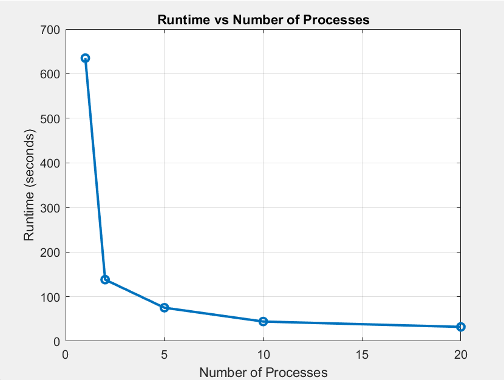

# System Programming Lab 11 Multiprocessing

- **Name:** Alion Bujku
- **Assignment:** System Programming Lab 11 Multiprocessing
- **Section Number:** 111
- **Date:** 11/25/2024
## Overview
The Mandelbrot movie generator creates a zooming sequence of the Mandelbrot fractal, 
using child processes to divide the computational workload. The program utilizes
semaphores to manage the number of concurrent processes. It accepts parameters such as 
image resolution, number of frames, zoom scale, and the number of child processes to optimize runtime.

The key enhancements include:
- **Parallel Computation:** The number of child processes is configurable using the `-p` flag.
- **Semaphore Management:** Ensures the number of concurrent processes does not exceed
the specified limit.
- **Dynamic Image Generation:** The 'generate_movie' function progressively zooms into
the fractal.

---

## Runtime Results

I measured runtimes for different numbers of processes and plotted them:

| Number of Processes | Runtime (seconds) |
|---------------------|-------------------|
| 1                   | 635               |
| 2                   | 138               |
| 5                   | 75                |
| 10                  | 44                |
| 20                  | 32                |

The graph below shows the relationship between the number of processes and runtime:



---

## Implementation Notes

- **Semaphore Management:** A semaphore (`sem_open`) is used to ensure that the number of
concurrently running child processes matches the user-specified value. The semaphore is
properly unlinked (`sem_unlink`) to prevent stale semaphore issues.
- **Child Process Management:** Each frame is generated by a child process, which computes
its portion of the fractal and saves it as a JPEG.
- **Zooming Logic:** Each subsequent frame reduces the zoom scale by a fixed factor,
creating the zoom-in effect.

---

## Discussion 
1. **Observations:**
    With a single process the runtime is significantly high at 635 seconds (10 minutes 35
    seconds). Increasing the number of processes reduces the runtime significantly.
    For example: 2 processes cut the runtime to 138 seconds (2 minutes 18 seconds),
    which is over 4.6 times faster than 1 process. At 5 processes the runtime is further
    reduced to 75 seconds (1 minute 15 seconds), a 57% improvement compared to 2 processes.
    At 10 processes the runtime reduced to 44 seconds which is a 41%.
    At 20 processes the runtime reduced to 32 seconds which was a 27% improvement.
2. **Analysis:**
    The runtime graph shows that as the number of processes increases the faster the 
    runtime becomes. Parallelizing the computation allows for a significant reduction in
    runtime highlighting the benefits of distributed workloads for computationally
    intensive tasks like fractal generation.
    
---

## How to Run
1. **Compile the Program:**
```
make
```
2. **Run the Program:**
- **Single Image**
```
./mandel -x <x-center> -y <y-center> -s <scale> -W <image-width> -H <image-height> -m <max-iterations> -o <output-filename>
```
- **Example:**
```
./mandel -x -0.5 -y 0 -s 4 -W 1000 -H 1000 -m1000 -o mandel.jpg
```
- **Movie Mandel**
```
./mandel --movie -x <x-center> -y <y-center> -s <scale> -W <image-width> -H <image-height> -m <max-iterations> -f <frames> -p <process>
```
- **Example (10 Processes)**
```
./mandel --movie -x 0.4 -y 0.3 -m 1500 -W 1500 -H 1500 -f 50 -p 21
```

